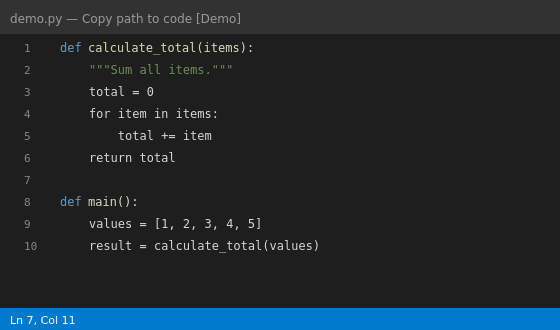

# Copy path to code



Copies the active file's path (with optional line range) to the clipboard in `@<path>[#L<range>]` format — ready to paste into AI chats and code reviews.

[](https://marketplace.visualstudio.com/items?itemName=onanmco.copy-path-to-code)
[](https://open-vsx.org/extension/onanmco/copy-path-to-code)
[](https://marketplace.visualstudio.com/items?itemName=onanmco.copy-path-to-code)
[](https://github.com/onanmco/copy-path-to-code/releases)
[](https://github.com/onanmco/copy-path-to-code/actions/workflows/ci.yml)
[](https://code.visualstudio.com/)

## Install

### From the VS Code Marketplace (recommended)

`Extensions` → search **Copy path to code** → Install.

Or visit [marketplace.visualstudio.com](https://marketplace.visualstudio.com/items?itemName=onanmco.copy-path-to-code).

### From Open VSX

Open VS Code's `Extensions` → search **Copy path to code** (with Cursor or other open-source VS Code builds).

Or visit [open-vsx.org](https://open-vsx.org/extension/onanmco/copy-path-to-code).

### From the GitHub releases

1. Go to [Releases](https://github.com/onanmco/copy-path-to-code/releases)
2. Download the latest `.vsix` file
3. In VS Code or Cursor: `Extensions` → `...` → **Install from VSIX...** → select the `.vsix`

### Assign a keyboard shortcut

`Ctrl+K Ctrl+S` → search **Copy path to code** → set your preferred shortcut. The command ID is `copy-path-to-code.copyPathToCode`.

### From source

```bash
npm install
npm run package
# → copy-path-to-code-<version>.vsix
```

Then install the `.vsix` as above.

## Usage

Open the command palette (`Ctrl+Shift+P` / `Cmd+Shift+P`) and run **Copy path to code**.

| Editor state | Clipboard output |
| --- | --- |
| Active file, no selection | `@/absolute/path/to/file.ts` |
| Single line selected | `@/absolute/path/to/file.ts#L12` |
| Multiple lines selected | `@/absolute/path/to/file.ts#L12-L18` |
| Multi-cursor | each cursor rendered with its line, sorted top-to-bottom, joined with `, ` |
| No active file / unsaved buffer | error notification — clipboard is left unchanged |

Lines are 1-indexed. Paths use native separators (`\` on Windows, `/` on macOS/Linux).

## Development

```bash
npm run watch            # esbuild watch mode
                         # F5 → launch Extension Development Host
npm run test:unit        # vitest unit tests
npm run test:integration # Extension Host tests
npm test                 # all tests
```
